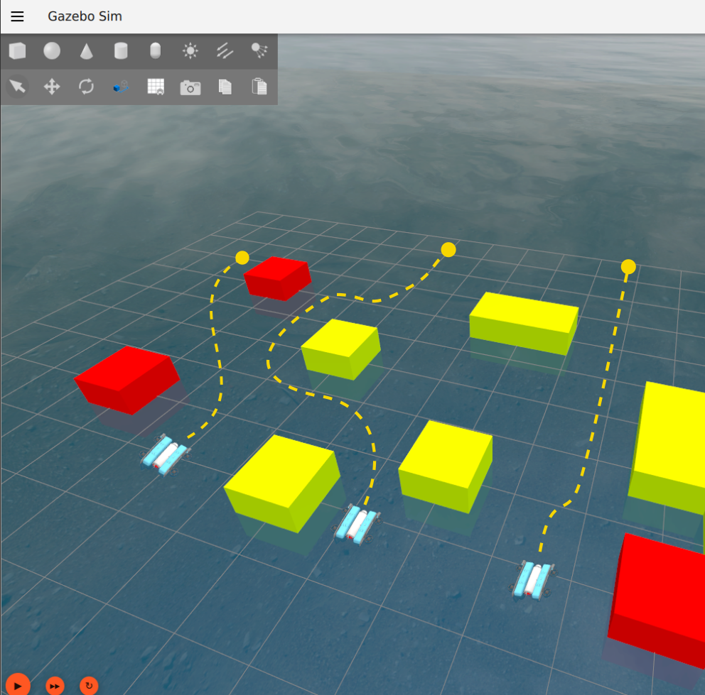

# Multi-Robot Angler :ocean:

### Disclaimer: We have raised PR to add multi-robot support to the [original repository](https://github.com/Robotic-Decision-Making-Lab/blue). 

Multi-Robot Angler is developed as an extension to [Blue](https://github.com/Robotic-Decision-Making-Lab/blue) to support multi-robot simulation. 

Blue is a ROS 2 pipeline designed to support development, testing, and deployment of underwater vehicles. To get started with Blue, please refer to the project [documentation](https://robotic-decision-making-lab.github.io/blue/).

## Multi Robot Simulation and Teleoperation

To launch multiple BlueROVs in Gazebo with non-conflicting communication channels, independent controllers, and perform keyboard based teleoperation follow below steps.

<div align="center">
   
</div>

### Dependencies

The following ROS 2 dependencies are required for this tutorial:

- Gazebo Harmonic or newer
- [ardusub_driver](https://github.com/JBVAkshaya/ardusub_driver/tree/iron_mp_v2)
- [auv_controllers](https://github.com/Robotic-Decision-Making-Lab/auv_controllers)
- [teleop_twist_keyboard](https://github.com/ros2/teleop_twist_keyboard)
- [mobile_to_maritime](https://github.com/Robotic-Decision-Making-Lab/mobile_to_maritime)

These dependencies will be met by default if you have installed Blue with
Docker as described in the [installation instructions](/installation).

### Tutorial steps

*Please checkout the iron-mp branch before following starting this tutorial.*

1. Launch the demo Dependencies for `rob_1` and `rob_3` instances in simulation by running the following commands:

   ```bash
   ros2 launch blue_demos rob_1_bluerov2_heavy_demo.launch.yaml use_sim:=true
   ```

   ```bash
   ros2 launch blue_demos rob_3_bluerov2_heavy_demo.launch.yaml use_sim:=true
   ```

2. Once Gazebo, ArduSub, and MAVROS have fully loaded, open a new terminal and launch the demo control framework for `rob_1` and `rob_3` instances:

   ```bash
   ros2 launch blue_demos rob_1_bluerov2_heavy_controllers.launch.py use_sim:=true
   ```

   ```bash
   ros2 launch blue_demos rob_3_bluerov2_heavy_controllers.launch.py use_sim:=true
   ```

3. For teleoperation, we will launch the `teleop_twist_keyboard` node for each robot instance in a new terminal:

   ```bash
   ros2 run teleop_twist_keyboard teleop_twist_keyboard --ros-args -r __ns:=/rob_1
   ```

   ```bash
   ros2 run teleop_twist_keyboard teleop_twist_keyboard --ros-args -r __ns:=/rob_3
   ```

4. As noted in Teleoperation tutorial, the `teleop_twist_keyboard` node will publish velocity commands according to
   [REP-105](https://ros.org/reps/rep-0105.html); however, the launched ISMC
   adheres to the maritime conventions recorded in [REP-156](https://github.com/ros-infrastructure/rep/pull/398).
   To convert the velocity commands to the appropriate convention, run the
   `message_transforms` node in a new terminal:

   ```bash
   ros2 launch message_transforms message_transforms.launch.py parameters_file:=<path/to/transforms.yaml>
   ```

   where `<path/to/transforms.yaml>` should be replaced with the path to the
   `transforms.yaml` file in the `blue_demos` package, e.g.,

   ```bash
   ros2 launch message_transforms message_transforms.launch.py parameters_file:=./blue_demos/multi_robot/teleoperation/config/rob_1_transforms.yaml ns:=/rob_1
   ```

   ```bash
   ros2 launch message_transforms message_transforms.launch.py parameters_file:=./blue_demos/multi_robot/teleoperation/config/rob_3_transforms.yaml ns:=/rob_3
   ```

5. You should now be able to teleoperate both the BlueROV2 using your keyboard from respective terminals.

## Citation

If you find multi-robot Angler to be helpful in your work, please consider citing our
paper:

```
@misc{agrawal2025underwatermultirobotsimulationmotion,
      title={Underwater Multi-Robot Simulation and Motion Planning in Angler}, 
      author={Akshaya Agrawal and Evan Palmer and Zachary Kingston and Geoffrey A. Hollinger},
      year={2025},
      eprint={2506.06612},
      archivePrefix={arXiv},
      primaryClass={cs.RO},
      url={https://arxiv.org/abs/2506.06612}, 
}
```
